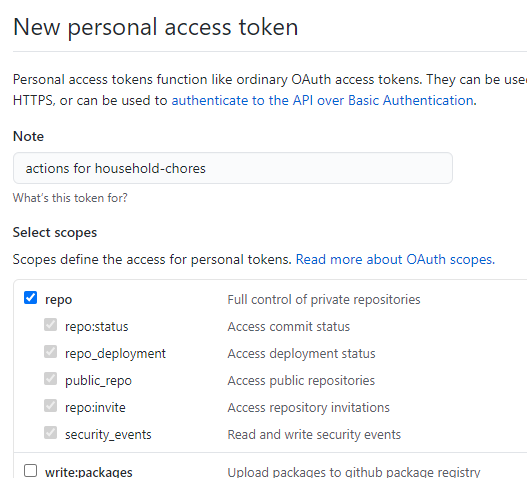
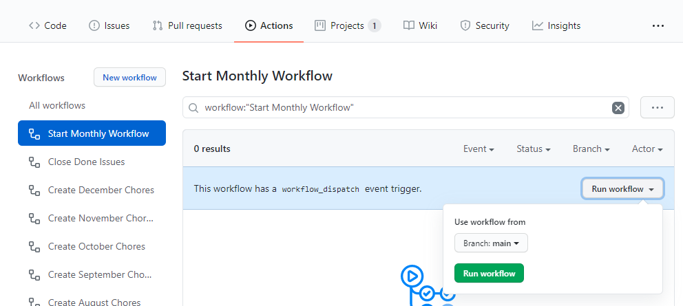
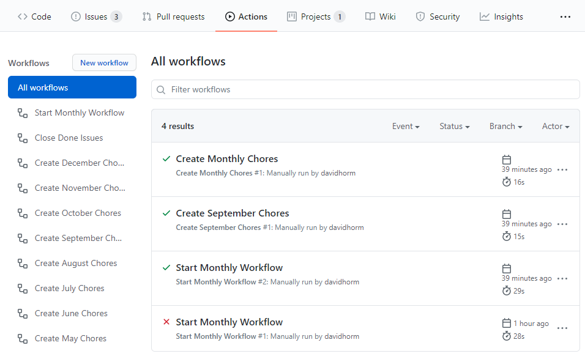
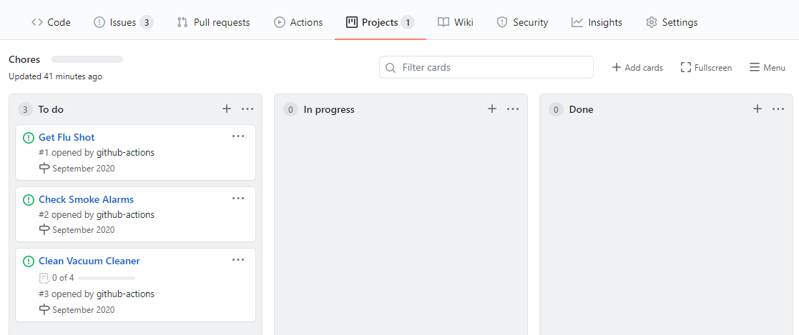
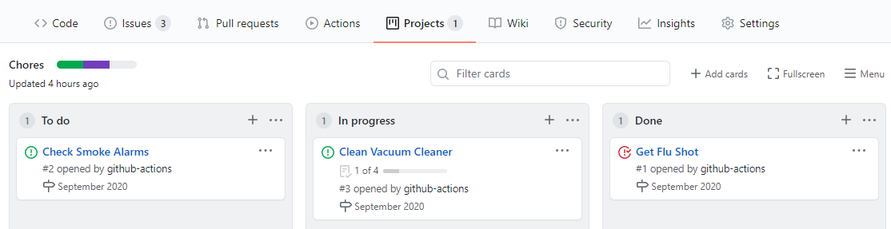

# Get Started

The guide assumes you know a thing or two about GitHub.

1. Copy the `.github/workflows/*.yml` files from this repo into yours.
    1. You can [Clone repo](https://docs.github.com/en/github/creating-cloning-and-archiving-repositories/cloning-a-repository)
    1. or [Fork repo](https://docs.github.com/en/github/getting-started-with-github/fork-a-repo)

1. [Create repo-level project board](https://docs.github.com/en/github/managing-your-work-on-github/creating-a-project-board#creating-a-repository-project-board)
    1. Project board name: `Chores`
    1. Project Description: _whatever you want_
    1. Project template: `Automated kanban`

1. Delete the default cards created with the project board.

This solution has one workflow calling other workflows, and that needs additional permissions configuration.

1. [Create Personal Access Token](https://docs.github.com/en/github/authenticating-to-github/creating-a-personal-access-token)
    1. Note: _whatever, but name of repro makes sense like_ `actions for household-chores`
    1. Select scope: Check `Full control of private repositories`
    

1. Copy the token generated

1. [Create Secret for Repo](https://docs.github.com/en/actions/reference/encrypted-secrets#creating-encrypted-secrets-for-a-repository)
    1. Name: `PERSONAL_ACCESS_TOKEN`
    1. Value: _paste in token copied in previous step_

The monthly actions are currently configured to run manually instead of monthly right now (so my example project
doesn't keep creating issues). But you can use this to confirm the workflows are working, and also to perhaps manually
test out future issues.

1. Click on `Actions` in the GitHub header.
1. Click on `Start Monthly Workflow` on the left nav
1. Click on the `Run Workflow` dropdown on the right.
1. Click on the `Run workflow` button.

1. Click on `All workflows` in the left pane to watch the workflow execute.
    1. ❌ means the workflow failed. Click into it to see more details
    1. ✔️ means the workflows succeeded.

1. Click on the `Projects` link in the header
1. Click on the `Chores` 

This is the list of issues that can be used to track chore status.

Drag an Issue to the `Done` column and a workflow will execute to automatically close the Issue.

